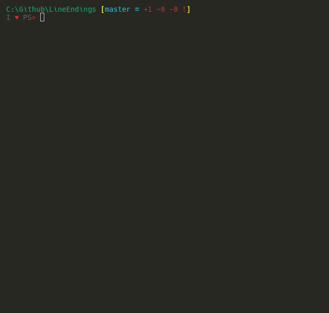
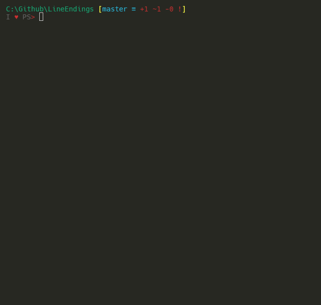

# Test Code

```powershell
'Test1'

Try
{
    'Test1 Pass'
}
catch
{
    'Test1 Fail'
}

'test2'

Try {
    'Test2 Pass'
}
Catch {
    'Test2 Fail'
}

'Test3'

Try {
    'Test3 Pass'
} Catch {
    'Test3 Fail'
}


```

## CRLF CTRL+V in Native ConsoleHost with PSReadline

* Test1: **Pass**
* Test2: **Pass**
* Test3: **Pass**
* All lines paste as single Code block
* Requires <Enter> to execute Code
* Line breaks are not treated as <Enter>


## CRLF CTRL+V in VSCode ConsoleHost with PSReadline

* Test1: **Fail**
* Test2: **Fail**
* Test3: **Pass**
* Every line treated as <Enter>, which breaks braces on a new line
* Automatically executes all code


## LF CTRL+V in Native ConsoleHost with PSReadline

* Test1: **Pass**
* Test2: **Pass**
* Test3: **Pass**
* All lines paste as single Code block
* Requires <Enter> to execute Code
* Line breaks are not treated as <Enter>


## LF CTRL+V in VSCode ConsoleHost with PSReadline

* Test1: **Fail**
* Test2: **Fail**
* Test3: **Pass**
* Every line treated as <Enter> which breaks braces on a new line
* Automatically executes all code


## CRLF CTRL+V in Native ConsoleHost without PSReadline

* Test1: **Pass**
* Test2: **Pass**
* Test3: **Pass**
* Line breaks cause seperate Code blocks, but blocks are not broken.
* Automatically executes all code
* Line breaks are treated as <Enter>


## CRLF CTRL+V in VSCode ConsoleHost without PSReadline

* Test1: **Pass**
* Test2: **Pass**
* Test3: **Pass**
* Line breaks cause seperate Code blocks, but blocks are not broken.
* Automatically executes all code
* Line breaks are treated as <Enter>



## LF CTRL+V in Native ConsoleHost without PSReadline

* Test1: **Fail**
* Test2: **Fail**
* Test3: **Fail**
* All lines are pasted into a single line
* Requires <Enter> to execute Code
* Line breaks are removed entirely
* Code breaks due to no new lines


## LF CTRL+V in VSCode ConsoleHost without PSReadline

* Test1: **Pass**
* Test2: **Pass**
* Test3: **Pass**
* Line breaks cause seperate Code blocks, but blocks are not broken.
* Automatically executes all code
* Line breaks are treated as <Enter>


